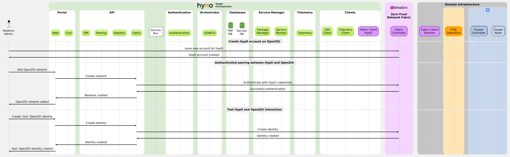
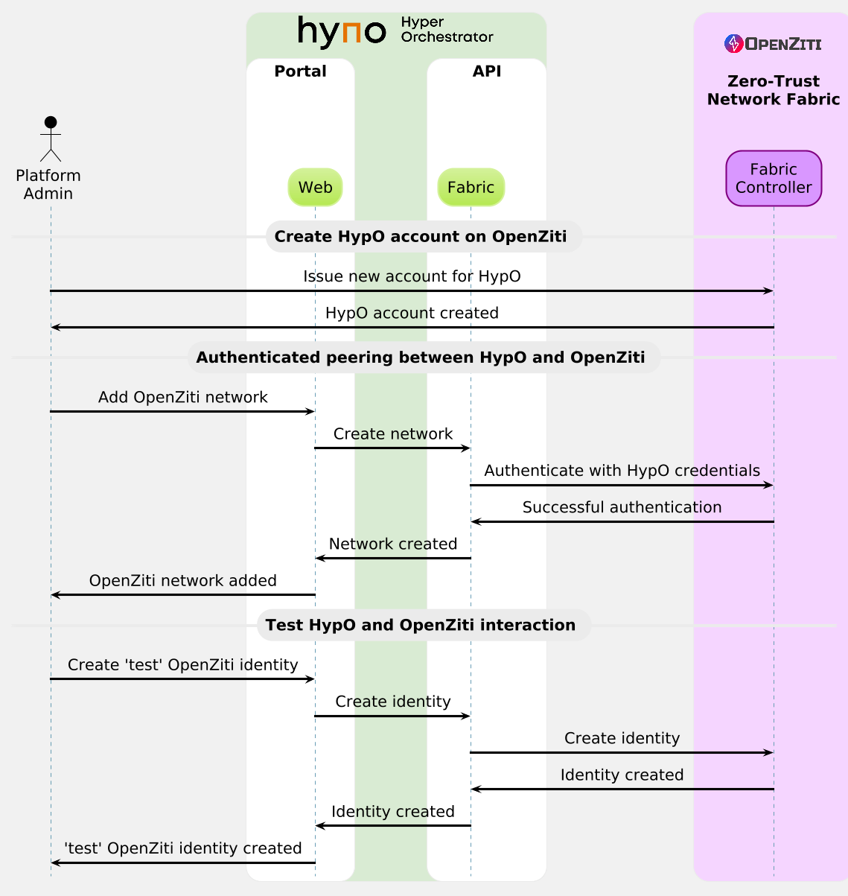

# ETSI HypO's common workflow UML library

This repository creates a UML library dedicated to [ETSI HypO](https://labs.etsi.org/rep/osl/hypo) and the ecosystem around it.
The purpose of this library is to be used by ETSI HypO stakeholders to design sequence diagrams that concern:
- Internal interactions among ETSI HypO platform components
- Interactions between ETSI HypO stakeholders and the HypO platform
- Interactions of the ETSI HypO platform and other systems, such as [ETSI OpenSlice](https://osl.etsi.org), [OpenZiti](https://netfoundry.io/docs/openziti/), and remote infrastructure controllers (i.e., [Kubernetes](https://kubernetes.io/)).

To exploit this common UML library and design your desired workflow, please follow the steps below.

## Install VSCode with extensions
- Install [VSCode](https://code.visualstudio.com/)
- Install the following VSCode Extensions (Shift+Ctrl+X):
  - Markdown All in One (`yzhang.markdown-all-in-one`)
  - PlantUML (`jebbs.plantuml`)

## Configure VSCode
Go to File > Preferences > Settings:
- Select "User" tab to apply the settings to user-wide VSCode or "Workspace" tab to apply them to this workspace only.
  - Both options are valid; it depends if you want to inherit these settings in other workspaces.
- Find the following settings using the search box and apply the values indicated:
  - `plantuml.server` : `https://www.plantuml.com/plantuml`
  - `plantuml.render` : `PlantUMLServer`

## UML template library

The basic templates of this library can be classified in three categories:

- a [color palette](palette/hypo-palette.puml) template providing the main colors.
- a [theme](theme/hypo-theme.puml) template providing the look and feel of the UML environment as well as the style of the primitive elements.
- a library of [components](components/hypo-components.puml) template providing the ETSI HypO components and external systems around it.

## Platform workflows

An [example workflow](hypo-flow-peering-hypo-openziti.md) shows how ETSI HypO peers with OpenZiti to jointly provide Zero-Trust Networking.

## Preview a Markdown file in VSCode

Open the example workflow file, e.g., [hypo-flow-peering-hypo-openziti](hypo-flow-peering-hypo-openziti.md).

Right click on it and click `Open Preview` or press `Shift+Ctrl+V`.

Shortly you will get the rendered Markdown page with the rendered diagram figure as below:



You may use this example as an inspiration to generate your preferred workflow.

## Show only the necessary blocks

In the figure above, you see the entire view of the ETSI HypO system, although this example only displays connections between a few elements. 

To hide the boxes that do not participate in your workflow, consider adding:

```
hide unlinked
```

at the top part of your workflow.

Then, the same workflow transforms into a minimal figure showing only the essential elements:


